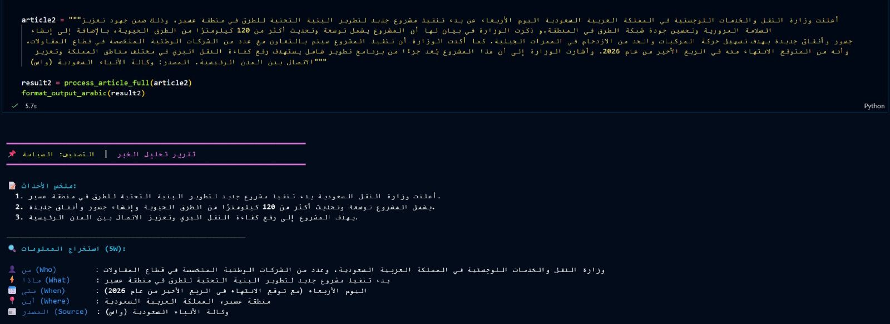

# Unified Arabic News Understanding System

Arabic NLP project for unified news understanding through topic classification, abstractive summarization, and 5W information extraction. The system uses CAMeLBERT-MSA, AraT5, and Gemini to analyze Arabic articles and produce a topic label, concise summary, and structured event details.

## ⚙️ System Workflow
This project is a unified Arabic Natural Language Processing system that analyzes news articles through three parallel tasks:

```text
Arabic News Article
        │
        ▼
Shared Preprocessing
        │
        ├── CAMeLBERT-MSA → Topic Classification
        ├── AraT5 → Abstractive Summarization
        └── Gemini 2.5 Flash → 5W Extraction
        │
        ▼
Unified News Analysis Output
```

The models run independently in parallel, so an error in one component does not propagate to the others.

## 🧠 Models and Tasks

| Task | Model | Output |
|---|---|---|
| Topic Classification | CAMeLBERT-MSA | Predicted news category |
| Abstractive Summarization | AraT5v2-base-1024 | Three-point Arabic summary |
| 5W Information Extraction | Gemini 2.5 Flash | Who, What, When, Where, and Source |

## 📊 Results

### Topic Classification

CAMeLBERT-MSA was compared with a BiLSTM baseline.

| Model | Accuracy | Macro-F1 |
|---|---:|---:|
| BiLSTM | 0.85–0.89 | 0.82–0.86 |
| CAMeLBERT-MSA | **0.98** | **0.98** |

CAMeLBERT-MSA performed better on long articles, rare Arabic vocabulary, and semantically similar categories.

### Abstractive Summarization

Three model and dataset configurations were evaluated.

| Model and Dataset | ROUGE-1 | ROUGE-2 | ROUGE-L |
|---|---:|---:|---:|
| AraT5 on XL-Sum | 0.180 | 0.040 | 0.170 |
| mT5-small on AsDs | 0.034 | 0.007 | 0.034 |
| AraT5 on Arabic News + Gemini | **0.380** | **0.231** | **0.370** |

The Arabic News dataset with Gemini-generated summaries achieved the best results, showing that high-quality training summaries were more effective than larger noisy datasets.

### 5W Extraction

Gemini produced structured JSON containing:

- Who
- What
- When
- Where
- Source

The model showed strong formatting consistency and returned `غير مذكور` when information was unavailable instead of inventing unsupported details.
### Result the End-to-End System


